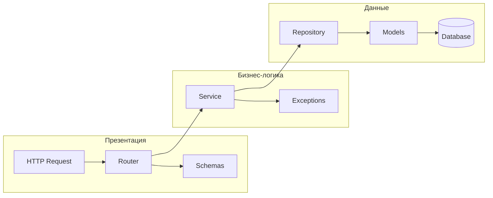
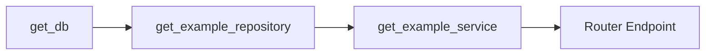
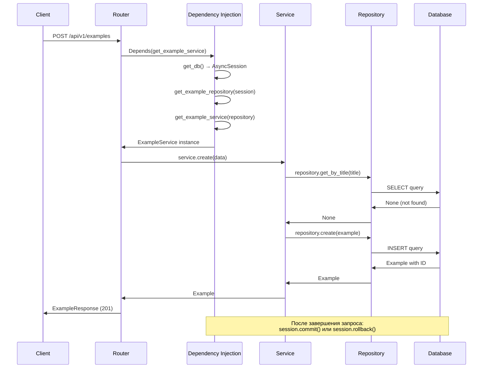

# Example Domain - Шаблон домена FastAPI

Эта папка содержит **эталонную реализацию домена** для FastAPI приложения. Используйте её как шаблон при создании новых доменов.

## Содержание

- [Архитектура](#архитектура)
- [Структура файлов](#структура-файлов)
- [Детальное описание файлов](#детальное-описание-файлов)
- [API Endpoints](#api-endpoints)
- [Примеры запросов](#примеры-запросов)
- [Dependency Injection](#dependency-injection)
- [Обработка ошибок](#обработка-ошибок)
- [Создание нового домена](#создание-нового-домена)

---

## Архитектура

Домен реализован по **трёхслойной архитектуре** с чётким разделением ответственности:



### Принципы архитектуры

| Слой | Файлы | Ответственность |
|------|-------|-----------------|
| **Презентация** | `router.py`, `schemas.py` | HTTP-запросы/ответы, валидация входных данных |
| **Бизнес-логика** | `service.py`, `exceptions.py` | Бизнес-правила, валидация, оркестрация |
| **Данные** | `repository.py`, `models.py` | Доступ к БД, ORM-модели |
| **Инфраструктура** | `dependencies.py`, `constants.py` | DI, конфигурация домена |

---

## Структура файлов

```
example/
├── __init__.py       # Экспорт роутера для подключения в main.py
├── constants.py      # Константы домена (статусы, лимиты)
├── dependencies.py   # Цепочка Dependency Injection
├── exceptions.py     # Доменные исключения
├── models.py         # SQLAlchemy модели (ORM)
├── repository.py     # CRUD операции с БД
├── router.py         # HTTP endpoints (API)
├── schemas.py        # Pydantic схемы (DTO)
└── service.py        # Бизнес-логика
```

---

## Детальное описание файлов

### `router.py` — HTTP Endpoints

**Назначение**: Тонкий слой для обработки HTTP-запросов.

**Принцип**: Роутер должен быть **ТОНКИМ** — никакой бизнес-логики! Только:
- Валидация запросов (через Pydantic)
- Вызов сервиса
- Форматирование ответа
- Установка статус-кодов

```python
@router.post("", response_model=ExampleResponse, status_code=status.HTTP_201_CREATED)
async def create_example(
    data: ExampleCreate,                                    # Валидация входных данных
    service: ExampleService = Depends(get_example_service), # DI
) -> ExampleResponse:
    example = await service.create(data)                    # Делегирование сервису
    return ExampleResponse.model_validate(example)          # Форматирование ответа
```

**Ключевые особенности**:
- Использует `Depends()` для инъекции сервиса
- `response_model` автоматически сериализует ответ
- Типизация возвращаемых значений для IDE

---

### `service.py` — Бизнес-логика

**Назначение**: Сердце домена — вся бизнес-логика находится здесь.

**Что делает**:
- Валидация бизнес-правил
- Оркестрация операций
- Выбрасывание доменных исключений

```python
class ExampleService:
    def __init__(self, repository: ExampleRepository) -> None:
        self.repository = repository  # Инъекция репозитория

    async def create(self, data: ExampleCreate) -> Example:
        # Бизнес-правило: заголовок должен быть уникальным
        existing = await self.repository.get_by_title(data.title)
        if existing:
            raise ExampleAlreadyExistsError(f"Example with title '{data.title}' already exists")

        example = Example(title=data.title, description=data.description)
        return await self.repository.create(example)
```

**Бизнес-правила в этом примере**:
1. Заголовок (`title`) должен быть уникальным
2. При обновлении проверяется уникальность нового заголовка
3. Удаление/обновление несуществующего элемента выбрасывает `NotFoundError`

---

### `repository.py` — Доступ к данным

**Назначение**: Чистый CRUD — только операции с базой данных.

**Принцип**: Репозиторий **НЕ выбрасывает бизнес-исключения**. Он возвращает:
- Объект, если найден
- `None`, если не найден
- Список объектов для коллекций

```python
class ExampleRepository:
    def __init__(self, session: AsyncSession) -> None:
        self.session = session  # Асинхронная сессия SQLAlchemy

    async def get_by_id(self, example_id: int) -> Example | None:
        """Возвращает Example или None, без исключений"""
        return await self.session.get(Example, example_id)

    async def get_all(self, skip: int = 0, limit: int = 20, is_active: bool | None = None) -> list[Example]:
        query = select(Example).offset(skip).limit(limit)
        if is_active is not None:
            query = query.where(Example.is_active == is_active)
        query = query.order_by(Example.created_at.desc())
        result = await self.session.execute(query)
        return list(result.scalars().all())
```

**Ключевые методы**:
| Метод | Описание |
|-------|----------|
| `create()` | Создание записи, `flush()` + `refresh()` для получения ID |
| `get_by_id()` | Поиск по первичному ключу |
| `get_by_title()` | Поиск по уникальному полю |
| `get_all()` | Список с пагинацией и фильтрацией |
| `count()` | Подсчёт записей для пагинации |
| `update()` | Сохранение изменений ORM-объекта |
| `delete()` | Удаление записи |

---

### `models.py` — SQLAlchemy модели

**Назначение**: ORM-модели для работы с базой данных.

**Синтаксис**: SQLAlchemy 2.0 с типизированными `Mapped` полями.

```python
from sqlalchemy.orm import Mapped, mapped_column

class Example(Base):
    __tablename__ = "examples"

    id: Mapped[int] = mapped_column(primary_key=True)
    title: Mapped[str] = mapped_column(String(MAX_TITLE_LENGTH), index=True)
    description: Mapped[str | None] = mapped_column(Text, default=None)
    status: Mapped[str] = mapped_column(String(20), default="draft")
    is_active: Mapped[bool] = mapped_column(default=True)

    created_at: Mapped[datetime] = mapped_column(server_default=func.now())
    updated_at: Mapped[datetime] = mapped_column(server_default=func.now(), onupdate=func.now())
```

**Особенности**:
- `Mapped[type]` — полная поддержка type hints для IDE
- `server_default=func.now()` — значение устанавливается на стороне БД
- `onupdate=func.now()` — автообновление при изменении
- `index=True` — индекс для ускорения поиска

---

### `schemas.py` — Pydantic схемы

**Назначение**: DTO (Data Transfer Objects) для валидации и сериализации.

**Синтаксис**: Pydantic v2 с `model_config`.

```python
from pydantic import BaseModel, ConfigDict, Field

class ExampleBase(BaseModel):
    """Базовая схема с общими полями"""
    title: str = Field(min_length=1, max_length=MAX_TITLE_LENGTH)
    description: str | None = Field(None, max_length=MAX_DESCRIPTION_LENGTH)

class ExampleCreate(ExampleBase):
    """Для создания — все обязательные поля"""
    pass

class ExampleUpdate(BaseModel):
    """Для обновления — все поля опциональны (PATCH)"""
    title: str | None = Field(None, min_length=1, max_length=MAX_TITLE_LENGTH)
    description: str | None = Field(None, max_length=MAX_DESCRIPTION_LENGTH)
    status: str | None = None
    is_active: bool | None = None

class ExampleResponse(ExampleBase):
    """Для ответа — включает автогенерируемые поля"""
    model_config = ConfigDict(from_attributes=True)  # Позволяет создавать из ORM-объекта

    id: int
    status: str
    is_active: bool
    created_at: datetime
    updated_at: datetime
```

**Паттерн схем**:
| Схема | Использование | Особенность |
|-------|---------------|-------------|
| `ExampleBase` | Базовый класс | Общие поля для наследования |
| `ExampleCreate` | POST запрос | Все обязательные поля |
| `ExampleUpdate` | PATCH запрос | Все поля опциональны |
| `ExampleResponse` | Ответ API | Включает `id`, timestamps, `from_attributes=True` |

---

### `dependencies.py` — Dependency Injection

**Назначение**: Цепочка зависимостей для FastAPI `Depends()`.

```python
async def get_example_repository(
    session: AsyncSession = Depends(get_db),  # Из src/database.py
) -> ExampleRepository:
    return ExampleRepository(session)

async def get_example_service(
    repository: ExampleRepository = Depends(get_example_repository),
) -> ExampleService:
    return ExampleService(repository)
```

**Цепочка DI**:


**Преимущества**:
- Автоматическое управление сессией БД
- Легко заменить реализацию для тестов
- Чистое разделение зависимостей

---

### `exceptions.py` — Доменные исключения

**Назначение**: Типизированные исключения для бизнес-ошибок.

```python
from src.shared.exceptions import AlreadyExistsError, NotFoundError

class ExampleNotFoundError(NotFoundError):
    """Example не найден по ID"""
    message = "Example not found"
    error_code = "example_not_found"
    # status_code = 404 (наследуется от NotFoundError)

class ExampleAlreadyExistsError(AlreadyExistsError):
    """Example с таким заголовком уже существует"""
    message = "Example with this title already exists"
    error_code = "example_already_exists"
    # status_code = 409 (наследуется от AlreadyExistsError)
```

**Как это работает**:

1. Сервис выбрасывает доменное исключение:
```python
raise ExampleNotFoundError(f"Example {example_id} not found")
```

2. FastAPI перехватывает его в `main.py`:
```python
@app.exception_handler(DomainError)
async def domain_error_handler(request: Request, exc: DomainError) -> JSONResponse:
    return JSONResponse(
        status_code=exc.status_code,  # 404
        content={
            "error": exc.error_code,   # "example_not_found"
            "message": exc.message,     # "Example 123 not found"
            "details": exc.details,
        },
    )
```

3. Клиент получает JSON:
```json
{
    "error": "example_not_found",
    "message": "Example 123 not found",
    "details": {}
}
```

---

### `constants.py` — Константы домена

**Назначение**: Конфигурационные значения домена.

```python
class ExampleStatus:
    DRAFT = "draft"
    PUBLISHED = "published"
    ARCHIVED = "archived"

DEFAULT_PAGE_SIZE = 20
MAX_TITLE_LENGTH = 200
MAX_DESCRIPTION_LENGTH = 2000
```

**Использование**:
- В `models.py` — длина полей `String(MAX_TITLE_LENGTH)`
- В `schemas.py` — валидация `Field(max_length=MAX_TITLE_LENGTH)`
- В `service.py` — бизнес-логика со статусами

---

## API Endpoints

| Метод | URL | Описание | Статус-код |
|-------|-----|----------|------------|
| POST | `/api/v1/examples` | Создать example | 201 Created |
| GET | `/api/v1/examples` | Список с пагинацией | 200 OK |
| GET | `/api/v1/examples/{id}` | Получить по ID | 200 OK |
| PATCH | `/api/v1/examples/{id}` | Частичное обновление | 200 OK |
| DELETE | `/api/v1/examples/{id}` | Удалить | 204 No Content |

---

## Примеры запросов

### Создание example

```bash
curl -X POST http://localhost:8000/api/v1/examples \
  -H "Content-Type: application/json" \
  -d '{
    "title": "Мой первый example",
    "description": "Описание для примера"
  }'
```

**Ответ (201 Created)**:
```json
{
    "id": 1,
    "title": "Мой первый example",
    "description": "Описание для примера",
    "status": "draft",
    "is_active": true,
    "created_at": "2024-01-15T10:30:00",
    "updated_at": "2024-01-15T10:30:00"
}
```

### Получение списка с пагинацией

```bash
# Базовый запрос
curl http://localhost:8000/api/v1/examples

# С пагинацией
curl "http://localhost:8000/api/v1/examples?skip=0&limit=10"

# С фильтрацией по статусу
curl "http://localhost:8000/api/v1/examples?is_active=true"
```

**Ответ (200 OK)**:
```json
{
    "items": [
        {
            "id": 2,
            "title": "Второй example",
            "description": null,
            "status": "draft",
            "is_active": true,
            "created_at": "2024-01-15T11:00:00",
            "updated_at": "2024-01-15T11:00:00"
        },
        {
            "id": 1,
            "title": "Мой первый example",
            "description": "Описание для примера",
            "status": "draft",
            "is_active": true,
            "created_at": "2024-01-15T10:30:00",
            "updated_at": "2024-01-15T10:30:00"
        }
    ],
    "total": 2,
    "skip": 0,
    "limit": 20
}
```

### Получение по ID

```bash
curl http://localhost:8000/api/v1/examples/1
```

**Ошибка (404 Not Found)**:
```json
{
    "error": "example_not_found",
    "message": "Example 999 not found",
    "details": {}
}
```

### Частичное обновление (PATCH)

```bash
curl -X PATCH http://localhost:8000/api/v1/examples/1 \
  -H "Content-Type: application/json" \
  -d '{
    "status": "published",
    "is_active": false
  }'
```

### Удаление

```bash
curl -X DELETE http://localhost:8000/api/v1/examples/1
# Ответ: 204 No Content (пустое тело)
```

---

## Dependency Injection

Диаграмма жизненного цикла зависимостей:



---

## Обработка ошибок

### Иерархия исключений

```
Exception
└── DomainError (base, status_code=400)
    ├── NotFoundError (status_code=404)
    │   └── ExampleNotFoundError
    ├── AlreadyExistsError (status_code=409)
    │   └── ExampleAlreadyExistsError
    ├── ValidationError (status_code=422)
    ├── AuthenticationError (status_code=401)
    └── AuthorizationError (status_code=403)
```

### Формат ответа об ошибке

```json
{
    "error": "example_not_found",      // Машиночитаемый код
    "message": "Example 123 not found", // Человекочитаемое сообщение
    "details": {}                       // Дополнительные данные (опционально)
}
```

---

## Создание нового домена

### Чеклист

Используйте этот чеклист при создании нового домена (например, `user`):

- [ ] **1. Скопировать папку**
  ```bash
  cp -r backend/src/example backend/src/user
  ```

- [ ] **2. Переименовать классы и файлы**
  - `Example` → `User`
  - `ExampleService` → `UserService`
  - `ExampleRepository` → `UserRepository`
  - `ExampleCreate` → `UserCreate`
  - и т.д.

- [ ] **3. Обновить `models.py`**
  - Изменить `__tablename__`
  - Определить поля модели
  - Добавить связи (если нужно)

- [ ] **4. Обновить `schemas.py`**
  - Определить поля для Create/Update/Response
  - Настроить валидацию

- [ ] **5. Обновить `constants.py`**
  - Определить статусы домена
  - Добавить лимиты полей

- [ ] **6. Обновить `exceptions.py`**
  - Создать доменные исключения
  - Наследовать от базовых (`NotFoundError`, `AlreadyExistsError`)

- [ ] **7. Обновить `service.py`**
  - Реализовать бизнес-логику
  - Добавить валидацию бизнес-правил

- [ ] **8. Обновить `repository.py`**
  - Добавить специфичные методы поиска
  - Настроить фильтрацию

- [ ] **9. Обновить `router.py`**
  - Настроить endpoints
  - Добавить документацию (summary, description)

- [ ] **10. Подключить в `main.py`**
  ```python
  from src.user.router import router as user_router

  app.include_router(user_router, prefix="/api/v1/users", tags=["Users"])
  ```

- [ ] **11. Создать миграцию Alembic**
  ```bash
  alembic revision --autogenerate -m "Add users table"
  alembic upgrade head
  ```

### Быстрый старт (скрипт)

```bash
# Создать новый домен
NEW_DOMAIN="user"
cp -r backend/src/example backend/src/$NEW_DOMAIN

# Переименовать в файлах (Linux/macOS)
cd backend/src/$NEW_DOMAIN
sed -i '' "s/Example/User/g" *.py
sed -i '' "s/example/user/g" *.py
sed -i '' "s/examples/users/g" *.py
```

---

## Полезные ссылки

- [FastAPI Documentation](https://fastapi.tiangolo.com/)
- [SQLAlchemy 2.0 Tutorial](https://docs.sqlalchemy.org/en/20/tutorial/)
- [Pydantic v2 Documentation](https://docs.pydantic.dev/latest/)
- [Alembic Migrations](https://alembic.sqlalchemy.org/)
